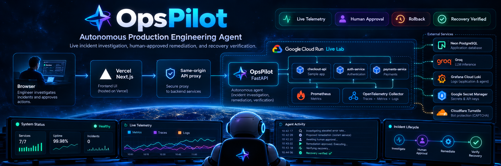
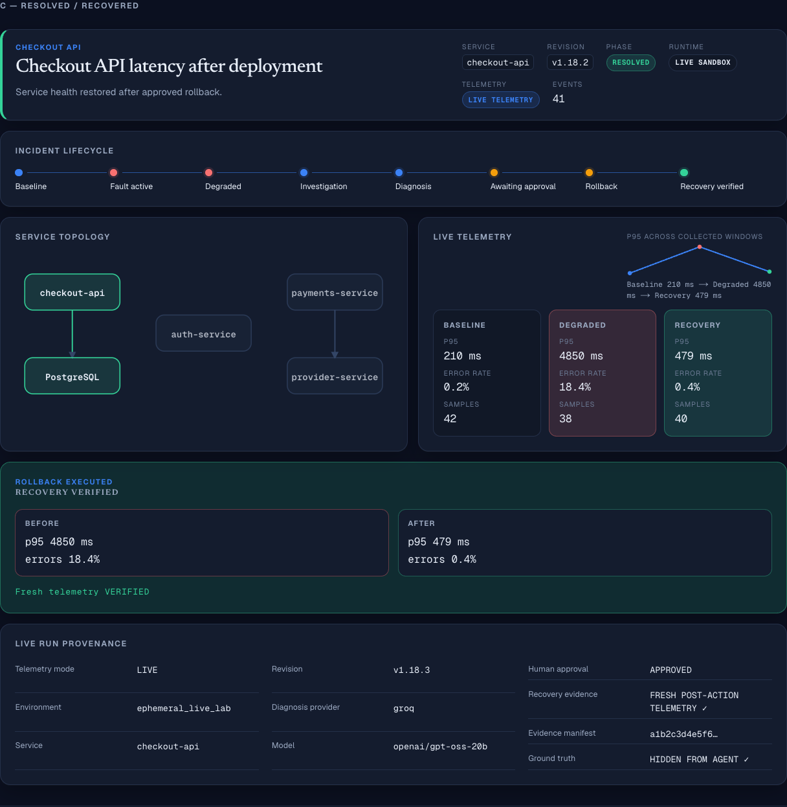
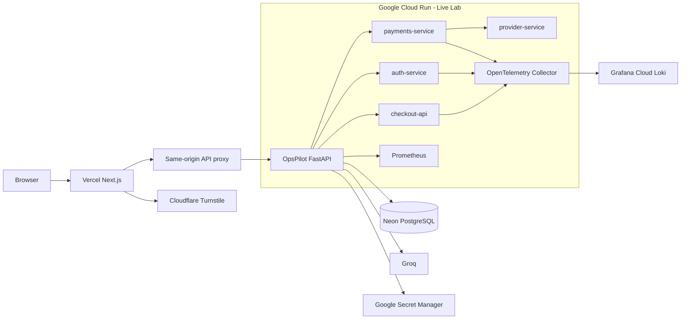
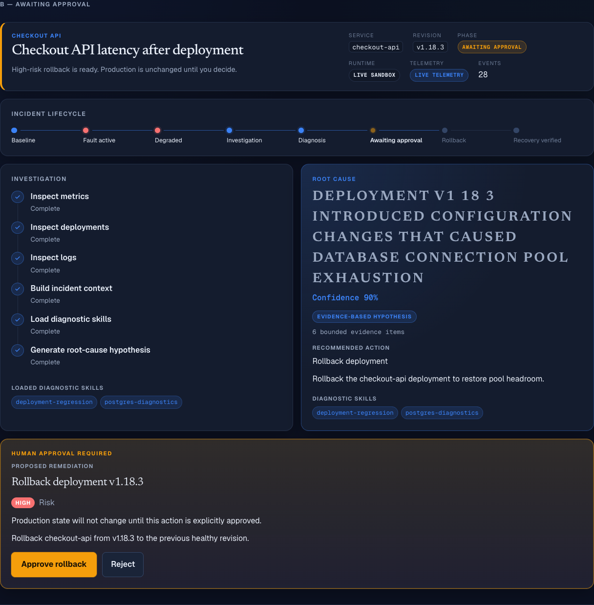

<p align="center">
  
</p>

<p align="center">
  <a href="https://opspilot-chi.vercel.app"><strong>🚀 Live Production Demo</strong></a>
  &nbsp;•&nbsp;
  <a href="#production-architecture"><strong>Architecture</strong></a>
  &nbsp;•&nbsp;
  <a href="#evaluation"><strong>Evaluation</strong></a>
</p>

---

OpsPilot is an AI powered production incident response system that investigates live sandbox services, gathers real telemetry and logs, forms evidence-grounded root cause hypotheses, proposes remediation, requires human approval for high-risk actions, executes approved rollbacks, and verifies recovery using fresh post action telemetry.

The public demo runs controlled ephemeral infrastructure rather than replaying precomputed incident results.



<p align="center">
  <em>Live incident run: degraded service → evidence-grounded diagnosis → human-approved rollback → fresh telemetry recovery verification.</em>
</p>

## Why OpsPilot

- **Real production style evidence:** Prometheus metrics, OpenTelemetry traces, Grafana Cloud Loki logs, deployment history, and runtime state feed the investigation.
- **Bounded autonomy:** the agent can diagnose and recommend, but high risk remediation requires explicit human approval.
- **Verified recovery:** approval and execution are not treated as success; OpsPilot requires fresh post action telemetry before marking an incident resolved.
- **Failure-aware AI:** structured model output, bounded fallback, typed provider errors, quota controls, and deterministic plus hosted-model evaluation.

## What This Demonstrates

Agentic AI orchestration, production observability, backend systems engineering, human in the loop safety, incident remediation, evaluation infrastructure, and cloud deployment in one end to end system.

## Highlights

- Live incident investigation across metrics, logs, deployments, and runtime state
- Evidence-grounded root cause hypotheses with Groq-hosted models
- Human approval before high risk rollback execution
- Fresh post-action recovery verification
- Durable incident, approval, lease, and provenance state in PostgreSQL
- Prometheus, OpenTelemetry, and Grafana Cloud Loki observability
- Deterministic baseline plus hosted model evaluation with hidden ground truth
- Shared sandbox safety controls, Turnstile protection, and rate limits
- Production deployment on Vercel and Google Cloud Run

## Incident Workflow

1. Select an incident scenario
2. Activate a controlled sandbox fault
3. Collect baseline and degraded telemetry
4. Inspect metrics, logs, deployment history, and runtime state
5. Build bounded incident context
6. Select diagnostic skills
7. Generate an evidence based root cause hypothesis
8. Evaluate the proposed remediation
9. Require human approval when the action is high risk
10. Execute approved remediation
11. Collect fresh post action telemetry
12. Verify whether recovery actually occurred
13. Persist provenance and audit events

Approval and recovery are deliberately separate states. An approved remediation is never reported as resolved unless fresh telemetry confirms recovery.

## Built in Live Incidents

### Checkout API

A deployment introduces PostgreSQL connection pool pressure and increased latency.

### Authentication Service

A deployment introduces JWT signature verification failures.

### Payments Service

A deployment introduces upstream provider timeouts and elevated request failures.

## Production Architecture



The Cloud Run live lab contains:

- OpsPilot FastAPI service
- checkout api
- auth service
- payments service
- provider service
- Prometheus
- OpenTelemetry Collector

External production services include:

- Neon PostgreSQL
- Groq
- Grafana Cloud Loki
- Google Secret Manager
- Cloudflare Turnstile

The public Cloud Run environment scales to zero when idle.

The repository also includes a Docker Compose production architecture with isolated services and observability boundaries.

## AI Diagnosis

The live diagnosis path uses Groq-hosted OpenAI compatible models with structured output.

Production behavior includes:

- `openai/gpt-oss-20b` primary diagnosis model
- bounded fallback for eligible structured output failures
- typed model responses
- explicit provider error handling
- bounded retry behavior
- per incident and daily quota accounting

The agent does not receive hidden incident ground truth during live diagnosis.

## Evidence and Observability

OpsPilot investigates using bounded evidence from:

- Prometheus
- OpenTelemetry
- Grafana Cloud Loki
- deployment history
- runtime service state
- diagnostic skills

The UI exposes:

- incident lifecycle
- live telemetry
- service topology
- evidence
- diagnosis
- proposed action
- approval state
- recovery evidence
- provenance
- audit trail

## Safety

High-risk remediation is deliberately gated by explicit human approval:



The public live lab includes:

- human approval for risky remediation
- a global sandbox lease
- per session incident limits
- Cloudflare Turnstile
- self reverting fault TTLs
- explicit fault cleanup
- durable approval records
- post action recovery verification
- quarantine behavior when cleanup cannot be proven
- sanitized public errors
- no hidden chain of thought exposure

## Evaluation

### Deterministic Baseline

The Evaluation view uses a deterministic reference provider rather than the live LLM.

It validates orchestration and safety behavior such as:

- root cause accuracy
- action accuracy
- approval compliance
- unsafe action rate
- remediation execution
- health recovery
- resolution rate

These reference results are not presented as live-model accuracy.

### Hosted - Model Evaluation

OpsPilot also evaluates a real Groq model against the same controlled simulated incidents with hidden ground truth. This measures real hosted-model reasoning, not live production telemetry accuracy.

The harness separates provider reliability from model quality, records only safe per trial outcomes, continues after typed provider failures, and keeps provider failures in the end-to-end denominator.

Run the default 3 scenarios x 3 trials:

```bash
GROQ_API_KEY=... python -m backend.app.evals.run_hosted --trials 3
```

Use `--json` for machine readable output.

After scorer calibration, the deterministic scorer was frozen before the final hosted benchmark. One frozen 3 x 3 run with `openai/gpt-oss-20b` produced:

- provider success: 88.9% (8/9)
- end to end pass rate: 55.6% (5/9)
- root cause accuracy: 62.5% over completed evaluations
- action accuracy: 100%
- approval compliance: 100%
- unsafe action rate: 0%
- remediation execution rate: 100%
- health recovery rate: 100%

Hosted model results are nondeterministic; these numbers describe one frozen scorer evaluation run.

## Tech Stack

**Backend:** Python 3.12, FastAPI, Pydantic, LangGraph, PostgreSQL

**AI:** Groq, OpenAI-compatible structured output

**Frontend:** Next.js, React, TypeScript, Tailwind CSS

**Observability:** Prometheus, OpenTelemetry, Grafana Cloud Loki

**Infrastructure:** Google Cloud Run, Docker, Docker Compose, Vercel, GitHub Actions, Google Secret Manager, Cloudflare Turnstile

## Repository

- `backend/` - API and incident orchestration
- `frontend/` - production command center
- `sandbox/` - controlled services and fault injection
- `simulator/` - deterministic reference environment
- `observability/` - Prometheus and OTEL configuration
- `deploy/cloud-run/` - public Cloud Run profile
- `tests/` - backend, safety, integration, and evaluation tests
- `scripts/` - validation utilities

## Local Development

See `LOCAL_RUN.md`.

Cloud Run deployment details are in `deploy/cloud-run/README.md`.

## Design Principle

OpsPilot treats diagnosis, approval, execution, and recovery as separate verifiable stages.

The goal is to make autonomous production-engineering behavior observable, bounded, reversible, and auditable.
